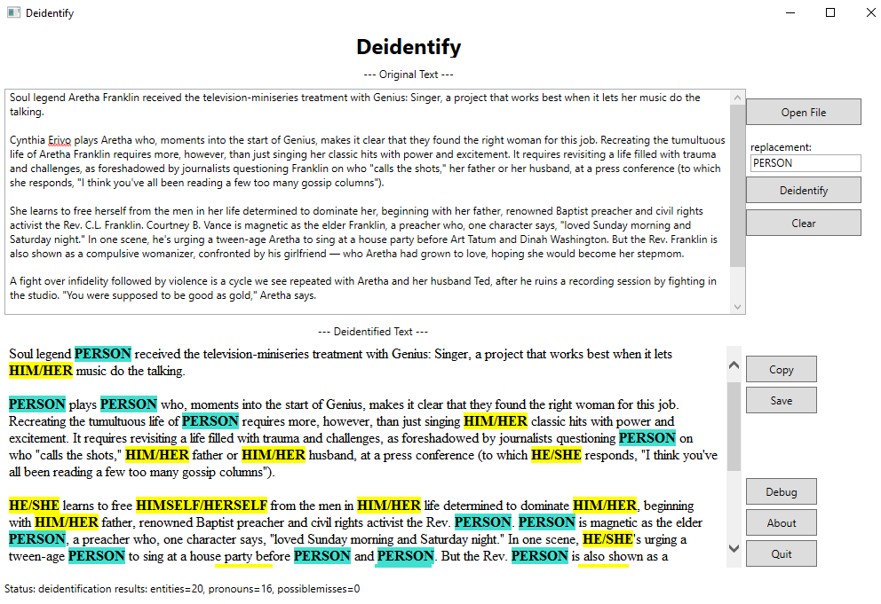

# deidentify-gui
An easy to use GUI for the [deidentify](https://github.com/jftuga/deidentify) command-line program, which is used to substitute a person's given name and/or surname along with any gender specific pronouns. 

## Screenshot

* If you see any `possible misses` in the `Status` bar, you will need to:
* * Click `Debug` which will open the log file in your web browser
* * Scroll to the bottom and review the `possible_misses` section

## Deployment
1) First, install the [deidentify](https://github.com/jftuga/deidentify) command-line program
* * Make sure you can successfully run this Python script from the command-line and get good results
* * Since `Python 3.9.x` was used to create the [Python Virtual Enviornment](https://docs.python.org/3/tutorial/venv.html), you, therefore, might want to use this version.
2) Unzip a [deidentify-gui release](https://github.com/jftuga/deidentify-gui/releases) such that these file reside in the same directory as the `deidentify` Python scripts
3) You may need to edit `deidentify_launcher.bat`:
* * Update the `VIRTUAL_ENV` to the full path to `deidentify`
* * You may also need to update the batch file to give the full path to `deidentify-gui.exe`
4) Create a desktop shortcut to `deidentify_launcher.bat`
* * Set the `Start In` location to the same directory as the `deidentify` Python scripts

## Example Deployment
* installed `Python 3.9.x`
* installed [deidentify](https://github.com/jftuga/deidentify) into: `c:\work\deidentify`
* unzipped a [deidentify-gui release](https://github.com/jftuga/deidentify-gui/releases) into: `c:\work\deidentify`
* edited `deidentify_launcher.bat`:
* * set `VIRTUAL_ENV` to: `c:\work\deidentify`
* * set exe path to: `start c:\work\deidentify\deidentify-gui.exe`
* Created a desktop shortcut to `deidentify_launcher.bat` with the `Start In` location set to: `c:\work\deidentify`
